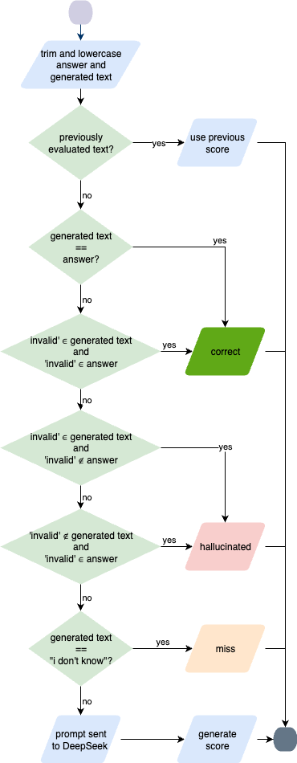

# Experiment Runner & Accuracy Validation

This directory contains the scripts and code for running the experiments and calculating answer accuracy.

## Structure

- **`t*/` Directories**: Each folder (e.g., `t1_thresholds_0.68`) contains the shell scripts for a specific experimental run. The name indicates the configuration (e.g., Run T1 with a threshold of 0.68).
- **`rag_accuracy.py`**: The main Python script for generating accuracy results.
- **`accuracy.sh`**: A shell script to conveniently execute `rag_accuracy.py`.

## Quick Start

1.  **Run an Experiment**: Navigate to a `t*` directory and execute the shell scripts within.
2.  **Validate Accuracy**: Run the accuracy script with your desired model:
    ```bash
    ./accuracy.sh
    ```

## Configuration

To change the validation settings, such as the model used, edit the `accuracy.sh` file. For example, modify the `--model` argument.

## Validation Process

The following diagram illustrates the accuracy validation workflow:

